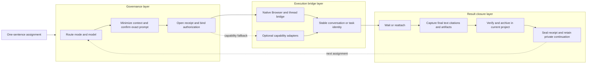

# Codex ChatGPT Web Orchestrator

[简体中文](README.md) | English

Route Codex tasks to ChatGPT Pro, Deep Research, and Work—then recover, verify, and reuse the results.

> **Public beta:** the repository is public, local gates and all three authorized live smokes pass. Chat Pro, Deep Research, and Work each reached a terminal result with complete captured output. Terms review and independent-user validation remain separate release gates.

This public-safe Codex Skill makes Codex the management hub for advanced work in a user's visible, signed-in ChatGPT session. Its core is an adapter-neutral delegation receipt: one tamper-evident record binding authorization, prompt fingerprint, submit-once state, model/mode evidence, terminal results, artifacts, citations, acceptance, and continuation—without publishing raw run identities.

It is an orchestration and governance layer, not a new browser automation runtime. The default path uses an already available Codex browser bridge and ChatGPT thread bridge. Optional adapters can map their own evidence into the same receipt. The included native/control-style and Oracle-style fixtures are structural examples only; they do not bundle third-party code or claim official compatibility.

## 30-second Quick Start

From this checkout, run a side-effect-free Work routing plan:

```bash
python3 scripts/orchestrator_cli.py plan --request tests/fixtures/requests/work.json --capabilities tests/fixtures/capabilities/native-all.json
```

Expected result: JSON selecting `work` on the `native` backend, choosing a new conversation, and ending at `prepare-exact-prompt-and-request-confirmation`. It never opens a browser or sends a prompt.

Run every local gate:

```bash
python3 scripts/check_candidate.py
```

## Product flow



The detailed responsibilities and non-goals are in [Architecture](references/architecture.md). The bridge contract is intentionally capability-based so UI-specific automation remains outside this project.

## What it does

- routes difficult consultation and critique to Chat with an explicitly verified Pro model;
- maintains one adapter-neutral, tamper-evident delegation receipt from authorization through acceptance and continuation;
- routes source-heavy investigations to Deep Research;
- routes long-running, multi-step deliverables to Work;
- prefers a referenced conversation when continuity matters and isolates independent evidence lanes;
- verifies mode and model evidence before submission;
- requires a live bound tab, matching Chat/Work surface, interactive composer, and two consecutive stable preflight reads before prompt fill and again before Send;
- fingerprints each prompt and enforces single-submit behavior;
- distinguishes `generating`, `partial`, `incomplete`, `complete`, `blocked`, and `unknown`;
- reattaches to the same conversation, task, tab, or saved session before considering any resend;
- captures complete Markdown, citations, downloadable artifacts, and continuation identity;
- treats returned content as untrusted until Codex verifies critical claims.

## What it does not do

- It does not provide hidden ChatGPT access or bypass authentication or product usage controls.
- It does not promise zero cost, unrestricted use, or exclusion from account allowances.
- It does not inspect cookies, tokens, browser profiles, account history, or credential stores.
- It does not install or authenticate a backend.
- It does not publish, purchase, message, deploy, upload, or change visibility without separate authorization.
- It is not an official OpenAI project and is not affiliated with, endorsed by, or sponsored by OpenAI or any optional backend project.

## Installation

Copy this folder as `codex-chatgpt-web-orchestrator` into a Codex skills directory, then start a new Codex task so discovery refreshes. No third-party dependency is required for the Skill itself.

Before installing, validate the source folder:

```bash
python3 scripts/check_candidate.py
```

After installation, invoke `$codex-chatgpt-web-orchestrator` with a bounded task. The Skill will stop before the first external transmission unless that exact imminent prompt is already authorized.

## Uninstallation

Remove only the exact `codex-chatgpt-web-orchestrator` folder you installed, then start a new Codex task. Do not recursively delete a skills root. Removing this Skill does not uninstall or alter browser bridges, optional backends, ChatGPT conversations, or archived artifacts.

## Executable dry-run examples

Plan a Pro consultation that reuses a referenced conversation:

```bash
python3 scripts/orchestrator_cli.py plan --request tests/fixtures/requests/chat-pro.json --capabilities tests/fixtures/capabilities/native-all.json
```

Plan a Deep Research run:

```bash
python3 scripts/orchestrator_cli.py plan --request tests/fixtures/requests/deep-research.json --capabilities tests/fixtures/capabilities/native-all.json
```

Evaluate a disconnected but still-generating run:

```bash
python3 scripts/orchestrator_cli.py recover --state tests/fixtures/recovery/disconnected-generating.json
```

Run the complete deterministic terminal demo:

```bash
bash demo/run_dry_demo.sh
```

These commands operate only on public fixtures. The CI-free local check verifies each README command contract without sending anything.

## Support matrix

Backend support is conditional on observable capabilities, not project names or installation alone. See the full [support matrix and fail-closed rules](references/backends.md).

| Route | Best fit | Required terminal evidence |
|---|---|---|
| Chat + Pro | Difficult reasoning, critique, synthesis, drafting | Visible Chat mode, exact approved Pro label, final readable assistant turn |
| Deep Research | Multi-source research with citations | Visible Deep Research mode, terminal cited report, ordinary source URLs |
| Work | Long-running tool/file work and finished artifacts | Visible Work mode, terminal task state, complete readable result and every required artifact |

## Failure and recovery

A local timeout is only “no event observed.” It is never permission to submit again. Recovery always starts from the same thread ID, conversation URL, stable tab key, task identity, or backend session:

1. reattach and locate the original user turn;
2. if generation is active, keep waiting on that run;
3. if terminal output exists, capture it immediately;
4. if only a tail or artifact is missing, mark `partial` or `incomplete`;
5. if commit cannot be proven, mark `unknown` and do not silently rerun;
6. propose a new send only after proving the first did not commit, or after explicit approval for a duplicate.

See [Run lifecycle](references/run-lifecycle.md) and [Result closure](references/result-loop.md).

## Known limitations

`PREFLIGHT-SURFACE-001` is a reproducible internal dogfood compatibility defect: in two pre-send Chat Pro attempts, the Pro label remained visible while the bridge/tab binding or Chat/Work surface could not stabilize. Both attempts correctly remained at `submission_count=0`; no prompt was filled or sent. The public fixture is [pro-label-visible-surface-unstable.json](tests/fixtures/preflight/pro-label-visible-surface-unstable.json).

The policy fix is fail-closed: a model label is only route evidence, not surface liveness. The bridge must establish the same identity, expected surface, interactive composer, and two matching read-only observations before prompt fill; it must repeat that gate immediately before Send. Reopening or reacquiring resets stabilization. This project cannot eliminate upstream tab or bridge failures, so repeated instability remains a Hold condition rather than permission to retry or switch surfaces silently.

## Internal dogfood evidence

The public-safe [dogfood ledger](dogfood/results.json) records two distinct evidence states without changing the release gate:

- **Completed success evidence:** one visible ChatGPT Pro image task produced three images. All three passed human review, and the web generation → download → local layout → source/hash archive chain completed. The web UI did not expose the underlying image model, so the ledger does not name or infer one. This validates that artifact-oriented result closure can work; it is not a claim that every content route is supported.
- **Completed terminal evidence:** after the `PREFLIGHT-SURFACE-001` fix, one long-running Pro task passed stable preflight, committed exactly once, remained on the same run identity, and completed without cancellation, follow-up, or retry. Approximately 35,897 characters were recovered and verified. This validates one complete preflight → submit-once → wait → same-run recovery → terminal capture path, but it does not change the separate incomplete Deep Research smoke or release gate.

Both entries are owner-reported internal dogfood summaries. Private conversation identities, archive paths, image contents, and hash values are deliberately excluded from the public package.

## Safety boundary

External transmission requires action-time confirmation of every exact prompt and destination. Minimize context; never send credentials, session data, private communications, personal data, protected paths, unpublished source, or third-party confidential material without explicit authorization for that exact material and destination.

The public-package scanner rejects likely personal paths, conversation IDs, email addresses, keys, tokens, cookies, and embedded secrets. It complements review; it does not prove that arbitrary prose is non-confidential. See [SECURITY.md](SECURITY.md).

## Usage and quota wording

This project can use the capabilities of a user's already signed-in ChatGPT session and may let advanced ChatGPT work be used separately from the current Codex task's working budget. That is not a promise of zero cost or unrestricted use. Chat, Pro models, Deep Research, and Work remain subject to plan, rollout, region, workspace settings, usage controls, and product limits. Work may consume shared credits under eligible enterprise agreements. Never guarantee that a run is excluded from an account allowance.

## Live smoke gate

The exact public-safe Chat Pro, Deep Research, and Work prompts, expected evidence, and observed results are stored in [smoke/prompts.json](smoke/prompts.json) and [smoke/EVIDENCE.md](smoke/EVIDENCE.md). Chat Pro and Work passed in the original authorized batch. A separately authorized Deep Research rerun also passed with a terminal cited report. Conversation URLs are retained only in a gitignored private run record.

All three live-smoke routes have passed. Status remains **Public beta** until the separate terms and independent-user validation gates are complete.

## Project files

- [SKILL.md](SKILL.md): agent-facing orchestration policy
- [Architecture](references/architecture.md): governance, bridge, and result closure layers
- [Delegation receipt protocol](references/delegation-receipt.md): public/private split, canonical integrity, and adapter mappings
- [Public receipt Schema](schemas/delegation-receipt.schema.json) and [private sidecar Schema](schemas/delegation-receipt-private.schema.json)
- [Backend matrix](references/backends.md): capability detection and degradation
- [Bridge contract](references/bridge-contract.md): adapter boundary
- [Run lifecycle](references/run-lifecycle.md): idempotency, state, and recovery
- [Known unstable-surface fixture](tests/fixtures/preflight/pro-label-visible-surface-unstable.json): pre-send bridge/tab regression coverage
- [Evidence and handoff](references/evidence-and-handoff.md): result verification and archival
- [Smoke manifest](smoke/prompts.json): exact live checks and result states
- [Internal dogfood ledger](dogfood/results.json): completed evidence kept distinct from release evidence
- [Local policy helpers](scripts/orchestrator_policy.py): side-effect-free decisions
- [Tests](tests/test_orchestrator_policy.py): behavioral gates and executable README examples
- [Receipt fault injections](tests/fixtures/faults/delegation-receipt-faults.json): deterministic tamper, duplicate-submit, and privacy failures

## FAQ

### Does this replace a browser controller?

No. It selects and governs an already available bridge. UI operation belongs to the native browser/thread bridge or an explicitly authorized optional adapter.

### Can it use my ChatGPT Pro subscription while Codex manages the project?

It can route work through a visible signed-in ChatGPT experience when the account exposes the requested mode. Availability and usage accounting vary; no quota separation is guaranteed.

### Why not send again after a timeout?

The first prompt may already be committed and generating. A blind retry can duplicate work, consume allowance, or create conflicting artifacts. Reattach first.

### Is a completed model response automatically trusted?

No. Codex must check decision-critical claims against primary sources and keep fact, inference, and unverified claims separate.

### Can I force Oracle or Agentify Desktop?

Yes, if it is already available, authorized, and proves the required capabilities. A specifically requested but incapable backend fails closed rather than silently switching.

### Is this an official OpenAI repository?

No. It is an independent interoperability project with no affiliation or endorsement.

## Development and release status

Run local checks with `python3 scripts/check_candidate.py`; run Codex's bundled `quick_validate.py` against this folder; then conduct the three authorized live smokes. No external CI workflow is included. See [CONTRIBUTING.md](CONTRIBUTING.md), [CHANGELOG.md](CHANGELOG.md), [third-party references](THIRD_PARTY.md), and [license candidates](LICENSE-CANDIDATES.md).

Suggested repository topics: `codex`, `chatgpt`, `chatgpt-pro`, `deep-research`, `chatgpt-work`, `agent-skill`, `codex-skill`, `browser-automation`, `ai-agents`, `orchestration`.

## Third-party acknowledgements

The optional adapter boundaries were informed by the public documentation for [codex-chatgpt-control](https://github.com/adamallcock/codex-chatgpt-control), [Oracle](https://github.com/steipete/oracle), and [Agentify Desktop](https://github.com/agentify-sh/desktop). Their code is not included. Each project has its own license, support status, security model, and compatibility risks.

The project uses the [MIT License](LICENSE). A tagged release remains a separate owner decision.
